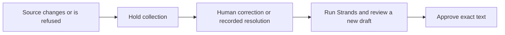

# Archon

**Archon helps a joiner reconcile inbox invoices and approve an exact collection draft with the source evidence beside it.**

### Controlled real-provider integration candidate

This branch prepares a real-provider path in the **same React application**:
semantic intake, Strands reasoning, saved asynchronous jobs, explicit real-email
approval and a separate durable SES outbox. The existing public deployment is
still synthetic: the joiner uses Records, a scripted model and simulated mail.
The [public AWS workstation](https://d2ssmv59q16d0b.cloudfront.net/) and the
[evidence](#evidence-and-limits) / [disclosures](#pre-existing-work-disclosed)
below describe that retained release, not live acceptance of this candidate.

`deploy/live_provider_stack.py` defines an isolated worker and retained failure
queue; `deploy/live_api_stack.py` adds opt-in parameters to a separately rendered
API template. Historical templates under `infra/` remain byte-identical, and
their old measurement does not qualify this new deployment. The public API
keeps its direct Bedrock/SES denies; it can dispatch only
its own worker. `LiveEnabled` defaults to `false`. Activation also requires the
exact verified sender/recipient, an operator-created private `operating-grant`
journal record with a finite budget/expiry and verified price ceilings, and
actual AWS acceptance. The grant is never created or extended by an anonymous
request. Reservations bound admitted provider usage under those price ceilings,
not the whole AWS account bill; infrastructure costs are separate.

Native Bedrock `CountTokens` rejects `anthropic.claude-opus-5` in eu-west-1.
The candidate therefore uses AWS's documented
[Mantle token-count route](https://docs.aws.amazon.com/bedrock/latest/userguide/count-tokens.html)
with SigV4 in eu-west-1, never a characters-to-token estimate. Unmapped content
fails before inference. A count-only endpoint response is not model acceptance.
The newest candidate still needs full CI and end-to-end live acceptance;
it is not ready to merge or deploy. Previously retained
synthetic results do not prove either real model judgment or email delivery.

In controlled mode the business examples remain fictional, but provider calls
and the approved email must be real. Provider IDs are not delivery proof.
Unknown attempts never resend automatically; interrupted jobs require operator
reconciliation. No inbox or bank connection is implied.

[Open the AWS workstation](https://d2ssmv59q16d0b.cloudfront.net/) ·
[Human UAT testbook](https://d2ssmv59q16d0b.cloudfront.net/UAT.testbook.html) ·
[CI](https://github.com/upgradedev/archon-aws-strands/actions/workflows/ci.yml) ·
[Evidence and limits](#evidence-and-limits) · [Disclosures](#pre-existing-work-disclosed)

[](https://github.com/upgradedev/archon-aws-strands/actions/workflows/ci.yml)
[](LICENSE)

For the joiner doing client collections alone from an inbox: inspect what was invoiced,
what was received, and why a draft is ready or held. Paste synthetic email in Records;
no mailbox is connected. This replaces a manual comparison of invoice, remittance and draft
within this demonstration. Time savings and recovered money have not been measured.

This source revision opens on a permanent introduction before accessing the session API.
Choose **Try the example** for a step-by-step invoice → payment → review → outcome check,
or **Continue my workspace** for the existing dashboard. Neither silently clears the books.
You inspect editable plain-text sources and approve the exact simulated draft yourself;
the example never auto-approves. Existing records resume in the same session. Use **New workspace**
and its explicit confirmation only when you want empty books. No PDFs, OCR or general email
understanding are claimed by this bounded reader. Current deployment is tracked below.

The deeper reconciliation path remains available:
From Dashboard, choose Start reconciliation and review the editable invoice. Post it, open
Review changed decision and run Strands. Before approving that draft, open Try new evidence before
approving and add the sample payment. The original draft disappears. The decision shows why the
recorded 600.00 EUR payment changes the proposed chase from 1,860.00 EUR to 1,260.00 EUR, linked to
the retained source and transfer reference. Run the graph again and review the new exact draft.

Then try Check a forwarded duplicate. It retains the posted receipt's transfer reference;
submitting it holds collection without crediting another payment. Review the original evidence
and record the duplicate resolution in Records before preparing a fresh draft. A missing Transfer ID
requires correction with actual evidence. Original sources and earlier provider receipts stay retained.
The changed decision is a supported workflow demonstration, not comparative AI or human superiority.

The public path runs real HTTP requests and a real Strands graph with six ledger tools.
The model is **scripted**, extraction uses bounded rules, and the outbox is **simulated**.
No public live model call or real email occurs. Removing Strands prevents draft preparation:
the composer only runs after all six readers have reported, and holds no tools of its own.

Current frontend SHA: [release.json](https://d2ssmv59q16d0b.cloudfront.net/release.json).
Current backend SHA and runtime modes: [API health](https://d2ssmv59q16d0b.cloudfront.net/api/health).
A branch CI pass is not evidence that this SHA is deployed.

[Current AWS acceptance](https://d2ssmv59q16d0b.cloudfront.net/acceptance.html) compares the
tested frontend/backend pair with the served versions. The public aggregate receipt is produced
only after all browser journeys and both release checks pass, with no failed or skipped cases.
An unavailable or historical receipt is not current acceptance. Human UAT remains NOT_RUN.
Source CI can require repository access; the sanitized aggregate does not. Historical testbooks
and run-scoped receipts are retained. The browser job receives no AWS credentials; a separate
main-only publisher can write only the existing frontend bucket. New frontend publication stops
if the deployed backend's packaged source differs; deploy that reviewed backend first and rerun.

## Contents

[Decision controls](#what-changes-the-decision) · [Workstation](#react-workstation-usage) ·
[Run it](#run-it) · [Architecture](#how-it-is-put-together) · [Evidence](#evidence-and-limits) ·
[Limitations](#limitations) · [Pre-existing work](#pre-existing-work-disclosed) ·
[Components](#third-party-components) · [Submission](#for-whoever-submits-this) · [Licence](#licence)

## What changes the decision

- A payment carries an explicit bank transfer reference. Email hashes identify evidence bytes,
  not payments. The same reference cannot credit again, even in a forward or a different subject.
  Distinct references can identify equal instalments on the same invoice/date/amount.
  A supplied reference is evidence, not independently verified bank settlement.
- The configured business is My Joinery, me@myjoinery.example in the public synthetic workspace.
  Original issuer and customer evidence determines payable versus receivable. “Billed to” alone
  does not make a sale. Conflicting directions stop intake. A forwarded message uses its original
  headers; the full source is retained.
- Missing identity asks for human correction. A duplicate can be linked to its original posted
  receipt without another credit. A disputed or ambiguous client reply holds collection until a
  person records an invoice-linked resolution. Resolution does not arbitrate a dispute.
- Corrections, new evidence, human resolution, ledger revision changes and expired drafts
  require fresh review. A SHA-256 fingerprint binds the exact text; the release gate rechecks facts.
  A hash is not proof that an invoice is true.
- Existing sessions retain posted sources. Historical equal payments without transfer identities
  remain readable with collections held for human reconciliation. No historical financial row is
  rewritten to assign it an invented bank identity. Records exposes each hold with a bounded
  identity-attestation form for distinct historical events. The additive attestation retains human
  notes and supplied references; it does not rewrite posted sources. Conflicting duplicate events
  require an operator accounting correction, not a fabricated second reference. The legacy
  one-firm SQLite surface has no attestation UI; hand its evidence to an operator.

## React workstation usage

The public source now selects `PublicPostReader` (`bounded-post-v2`): explicit ISO dates or
full English month names, and two-decimal EUR amounts such as `2,400.00` or `2.400,00`.
Net, VAT and gross must be stated and reconcile. Conflicting dates, totals or invoice references
are refused, not resolved by taking the first match. Relative dates, OCR and general prose remain
unsupported. Original text, invoice direction and transfer-identity guards remain authoritative.
The legacy `LocalReader` and the frozen AR3 baseline are unchanged. The new development regressions
are not independent held-out evidence, a model result or a rerun of the historical comparison.

In Payment arrangement, read the client's dated terms and either approve that exact plan or
choose **Offer different payment dates**. Review your counterproposal and explicitly record it.
The original reply and counterproposal survive reload and appear in the readable evidence bundle.
A counterproposal is pending client acceptance: it sends no message, changes no debt and creates
no collection hold. Record a fresh client reply before approving an arrangement. New evidence,
holds, expired proposals or stale revisions require review again. An arrangement changes chase
timing, not the balance. The original reply is also retained when a client plan is approved.

Navigation: Introduction → Guided check, or Dashboard → Workspace → Records → History.
The persistent navigation explains each task: balances, review/approval, invoices/payments and
decisions/receipts. Legacy bookmarks still resolve.
Invoice and source selection survives navigation and reload. Only the backend's oldest overdue
invoice, largest on a tie, can be prepared; inspecting another invoice does not retarget it.

Dashboard balances derive from retained posted documents using exact cents. Observed session
outcomes count posts, refusals, corrections, resolutions and approval records. Human active time,
time saved, revenue and recovery benefits remain Unknown. Quarter reports are labelled separately.

Records also previews UTF-8 `.txt` and plain-text `.eml` files up to 32 KB. Choose a file, inspect
its literal text, then Use file text in editor. Only Read & post email submits it to the reader.
Empty, binary, oversized, encoded, HTML and multipart files are rejected with recovery guidance;
PDFs, images and attachments are not supported in this intake. Paste preserves the existing API path.

In Workspace or History, Prepare evidence bundle reads durable state. Download or Copy readable
evidence keeps that exact snapshot; clipboard failure leaves the download and selectable text available.
The readable export includes redacted
source excerpts, source hashes, decisions, corrections, backend and ledger revisions, runtime mode,
failure/recovery guidance and limits. Redaction is best effort; review before sharing.
The bundle does not attest authenticity, bank settlement, compliance or email arrival.

Public sessions use private S3 through API Gateway and Lambda, behind CloudFront and private S3
frontend hosting. Same-origin /api/* requests carry an opaque session handle. Session access expires
after seven days; physical storage retention is separately configured. The browser keeps only the
handle. Refresh durable state after an uncertain action; do not retry unknown sends automatically.
New workspace creates an empty session and does not delete the old records.

Local API storage is SQLite through ARCHON_SESSION_DB. Lambda uses ARCHON_STATE_BUCKET and a
private ARCHON_STATE_PREFIX. S3 errors never silently switch to temporary storage.
The public runtime cannot enable SES or Bedrock. No visibility or secret changes are needed.

## Run it

The login-free AWS URL above is the short path. These development commands run in CI for this
workspace; dependency installation, builds and tests are not run on the workstation.

Offline demonstration, with synthetic documents, scripted tone and simulated acceptance:

```bash
pip install -e ".[dev]"
python -m archon.demo
python -m uvicorn archon.web.app:app --port 8000
python -m archon.web.export site
```

The server-rendered app and static export are legacy regression surfaces, separate from the React
workstation. The static export is not interactive. There is no tenancy in that legacy one-firm
ARCHON_STORE configuration; the public API instead isolates synthetic visitor sessions.

Operator-only reasoning:

```bash
python -m archon.demo --live-model
```

ARCHON_BEDROCK_MODEL_ID defaults to eu.anthropic.claude-opus-5;
ARCHON_BEDROCK_REGION to eu-west-1; ARCHON_BEDROCK_MAX_TOKENS to 1024.
The configured Bedrock factory supplies the graph's model, region and token budget.
Extraction has a separate 4000-token budget; it is not a reasoning measurement.
ARCHON_BUSINESS_EMAIL and ARCHON_BUSINESS_NAME identify whose books an operator reads.

Operator live sending is separately gated by --live-send, explicit
ARCHON_OPERATOR_SEND_AUTHORIZATION=I_AUTHORIZE_CONTROLLED_SEND, a durable ARCHON_SEND_LEDGER
and an exact ARCHON_VERIFIED_RECIPIENT. Account/recipient eligibility must be verified by the
operator; historical SES sandbox observations are not current delivery authorization.
Provider acceptance is not delivery; unknown outcomes never retry automatically.

## How it is put together


The SVG is retained as the operator architecture illustration; it is not evidence of a deployed
mailbox or SES delivery. The image also works where a submission form renders no Mermaid.
The deployed public path is:

```mermaid
flowchart LR
  email["Synthetic email in Records"] --> reader["Redact and read bounded fields"]
  reader --> ledger["Check parties, transfer identity and arithmetic"]
  ledger --> graph["Six Strands readers"]
  graph --> composer["Composer: scripted, no tools"]
  composer --> gate["Exact draft and human approval"]
  gate --> receipt["Simulated acceptance"]
```



Every edge into the composer waits for all six reports. Strands executes the tools and joins
their outputs; it does not guarantee source authenticity. The scripted model walks the graph;
it does not judge. Ledger code selects the invoice and calculates amounts.

The runtime package declares strands-agents>=1.53.0; exact resolved versions are recorded by CI.
Live inference is optional operator behavior and has not been remeasured by this change.
AgentCore is not implemented; the [design note](docs/BEDROCK_AGENTCORE_ARCHITECTURE.md) is historical.

## Evidence and limits

AR3 is source-prepared, not a real-model result. Its [frozen development protocol](evaluation/ar3_data/protocol.json)
separates twelve synthetic inputs from gold labels and compares the existing rule reader with future
exact-request offline replay using the same redaction and document guards. The evaluation-only citation
contract checks source/revision and literal spans; it is not shipped ingestion functionality or semantic
entailment. Source CI runs `python -m evaluation.ar3 --candidate-sha "$CANDIDATE_SHA" --output ar3-output`
with blocked network/cloud clients, negative fixtures and retained failures. The [prior receipt inventory](evaluation/ar3_data/prior-inventory.json)
found no comparable full request/response pairs: historical text and scripted runs are not new AI evidence.
Exclusive, fsynced journals preallocate every slot, checkpoint requests before adapters and raw responses
before parsing. Interrupted runs retain completed/started/unrun slots without a successful final summary;
an in-flight response lost before its checkpoint remains unknown. Only `end_turn`/`stop_sequence` are
accepted final response reasons. Original replay bytes are retained before parsing; runs are never pooled.
Author-created development cases, not independent accuracy; arithmetic is deterministic, not AI reasoning.
Model/infra costs remain unknown. AR3/C1, human benefit and any paid model activation remain owner-gated.

The [bounded collector](evaluation/ar3_collect.py) is evaluation-only direct Bedrock Converse, **not
the Strands graph**. Source CI exports exact frozen requests/sizes and exercises the full collector
with fake responses before replaying the unchanged evaluator; fake artifacts are labelled offline.
No model ran merely because these checks passed. The frozen 12 cases, prompt, model and `maxTokens=4000`
are unchanged. No CountTokens, tools, media, explicit cache creation, thinking override, fallback or
repair loop is added. Provider-default adaptive thinking may yield reasoning blocks rejected by the
frozen response contract; preserve that outcome, do not strip blocks or retune the protocol.

The new product source is no longer compatible with the frozen collector's whole-source pin.
Current source CI must report `SOURCE_CHANGED_COLLECTION_DENIED`, not export an activation plan.
It tests this refusal and retains a separate positive prepare-only check at compatible snapshot
`d8194c0413d5414e3acf071f55efe2d820565af7`, with its own imports. No old pin, request or model is
changed. A current-product model evaluation needs a separately preregistered instrument and grant.

Reservations use `2 * canonical_serialized_request_UTF8_bytes + 4096` input tokens per request:
the byte term deliberately overcounts visible text/JSON, with an additional multiplier and fixed
template allowance. This is a **conditional conservative assumption**, not a tokenizer measurement
or universal bound. The parent must verify it for this model, default thinking, implicit caching and
standard-tier billing before granting any call. Input bounds above 20000, output other than 4000,
more than 12 calls, expired/wrong grants and insufficient whole-cohort reservations fail closed.
Botocore `total_max_attempts=1`, a 900-second collector boundary and 5/60-second connect/read timeouts
bound execution. The time boundary is checked between calls, not a hard interruption of an in-flight
SDK call; the workflow has a 20-minute outer limit including install/upload. Unknown outcomes consume
their full reservation. Observed ceiling/cache-write/retry violations halt subsequent calls, not undo
an already-started call. Full SDK envelopes/usage/request IDs are retained before inspection (not
original HTTP wire bytes), with opaque SDK binary values represented by typed base64 objects and
flushed chunked stdout backup; log delivery itself is not guaranteed.

Future activation is parent-only in the existing manual `ci.yml`, never push/PR. The parent configures
the protected `ar3-bounded-evaluation` environment with `AR3_EVAL_ROLE_ARN` (an existing eligible role)
and `AR3_GRANT_SHA256` (SHA256 of the **exact UTF-8 JSON input bytes**). No IAM resources or settings are
created here. The inline session policy permits only this model's EU inference profile/foundation
model `bedrock:InvokeModel`; permission/trust compatibility remains untested until parent activation.
The grant binds `schema=archon-bounded-converse-v1`, `candidate_sha`, `instrument_sha`,
`protocol_sha256`, exported `plan_sha256`, `model_id`, `region`, `max_calls=12`, `max_output_tokens=4000`,
`max_input_tokens<=20000`, `max_seconds=900`, `input_bound_method` from the export,
`input_bound_verified=true`, `billing_assumptions_verified=true`, `service_tier=standard_default`,
`thinking_policy=FROZEN_PROVIDER_DEFAULT_NO_OVERRIDE`, exact `repository`, `actor`, `workflow_ref`,
next manual `run_number` (string), `run_attempt="1"`, and `expires_utc` within one hour. It also requires
`grant_id`, `parent_budget_ledger_ref`, `price_evidence`, `input_bound_evidence`, `budget_usd`,
`input_usd_per_million` and `output_usd_per_million` as positive finite decimal strings for money/rates.
The reference 5.50/27.50-per-million export estimate is **not** that grant, a bill or a shared budget.
The parent reserves the whole app slice in the separate aggregate ledger before configuration;
this collector cannot coordinate or infer another app's spend. A new run number or any rerun needs
new authority; rerun attempts above 1 are refused. Concurrent source runs can advance the workflow
counter, which causes safe denial, not automatic grant repair. After approval and green exact-source CI,
the activation command format is `gh workflow run ci.yml --repo upgradedev/archon-aws-strands --ref
<reviewed-branch> --field ar3_grant_json='<exact-approved-JSON>'`. **Do not run this as a source check.**

The opt-in `x1_benchmark` input on [frontend verification](https://github.com/upgradedev/archon-aws-strands/actions/workflows/frontend-ci.yml)
runs the [frozen X1 protocol](frontend/benchmarks/x1-protocol.json): ten new-payment and ten
forwarded-duplicate journeys, no retries, a 15-minute invocation limit, raw outcomes and nearest-rank
p50/p95 with failures retained in the denominator. Run-specific artifacts include source/served-build
identities, timing boundaries and checksums. Finalized byte snapshots are separate from child-writable
journals; `kill_requested` is not `exit_confirmed`. Corrected-instrument runs remain separate, never pooled.
This measures CI browser orchestration with a scripted
model, not AWS/model latency or human time saved. Paid model calls/cost are zero only for verified
scripted runs; AWS infrastructure and runner dollar costs remain unknown. It never deploys or sends mail.

The separate [X1 correlation component](telemetry/lambda_entry.py) is **source-only, not deployed**.
It wraps the unchanged Lambda handler with additive response headers and one bounded metadata log;
no event body, path/query, caller identity, session, authorization or exception text is logged by it.
Only runtime `context.aws_request_id` supplies `x-archon-lambda-request-id`; caller request IDs never
become trusted telemetry. Source commit and function-version headers support mismatch detection.
Context is invocation-local and reset on failure. Missing context/logs remain unknown, not inferred.
The [offline exporter](telemetry/correlate.py) requires a unique API response/structured receipt/text
REPORT join with matching source, function ARN/version and log group/stream. Duplicate, missing or
mismatched rows stay in the denominator. Duration/billed duration retain explicit ms units;
infrastructure/model dollars stay null, never calculated from duration alone.

Future operator input is a JSON object with `expected_runtime` (source_sha, function_arn,
function_version, log_group), `requests` (consecutive ordinal, status, response_headers pairs from
`capture_response`, which retains only the three correlation response headers), and `events`
(logGroupName, logStreamName, message from an independently retained CloudWatch export).
After explicit collection authorization, `python -m telemetry.correlate --input <export.json>
--output <new-directory>` retains exact input bytes before parsing, then checksummed result files;
exit2 means incomplete correlation, not zero usage. Limits:1000 API rows,10000 events,10MiB input.
CI runs synthetic full-flow/negative controls without AWS/network. No new live runner or activation
is wired. A future release must explicitly package `telemetry/` beside `archon/`, review/select
`telemetry.lambda_entry.handler`, capture response headers and verify exact runtime identity/logs.
This telemetry-only component does not alter infra, the frozen AR3 evaluator/collector/protocol
or X1 benchmark. Its source pins remain unchanged by the public product reader introduced above.
The component adds no IAM, environment or deployment changes.
Log delivery can fail; only text REPORT format is supported. Supplied exports/configured SHA labels
are not cryptographic origin or deployment attestations. This is not full-service cost, model latency
or user time saved. Runtime fields and REPORT units follow the
[AWS context](https://docs.aws.amazon.com/lambda/latest/dg/python-context.html) and
[logging references](https://docs.aws.amazon.com/lambda/latest/dg/python-logging.html).

Both earlier comparisons are withdrawn and stay withdrawn. They scored Archon from books that
fixtures had already posted correctly: a ledger agreeing with itself. Their historical files and
transcripts remain retained; they are not current product performance claims.

The retained [2026-09-09 evaluation](evidence/RESULTS-FAIR-2026-09-09.md) reported zero Archon chases.
That zero was achieved by not acting. It is not evidence of accuracy or usefulness.
The prior evaluator did not enforce exact target invoice and nonempty correct recipient.
Fresh synthetic contract tests now cover those fields and amount separately. No new benchmark
score, held-out reuse, competitive superiority or live model measurement is claimed.
The current classifier rejects a wrong invoice as `wrong-invoice`, and an empty recipient as
`wrong-recipient` when earlier checks pass. Multiple simultaneous faults still fail: the retained
taxonomy reports the first category, not every category. Relabeling a refusal is not a product fix.
python -m archon.evidence.fair is an evaluator command, not evidence of current performance.

Historical material: [first withdrawn set](evidence/RESULTS-2026-09-04.md),
[withdrawn hard set](evidence/RESULTS-HARD-2026-09-08.md),
[correction](evidence/RESULTS-CORRECTED-2026-09-08.md). The injection transcript belongs to a
withdrawn set; it has not been re-run on independent post and establishes no current advantage.

[Prior AWS acceptance](https://github.com/upgradedev/archon-aws-strands/actions/runs/34357703424)
is bound to 519a1e7c11a995529113161344192240fd031459 and artifact 10106786411, not this branch.
Current counts and coverage come from exact-SHA CI logs and artifacts, never a static estimate badge.
CI asserts the Strands API surface, runs unit/functional tests and real-HTTP desktop/mobile
Playwright, and checks documentation claims. Frontend coverage floors remain 85% in every measure.

Main merges still run offline checks → AWS frontend release → live Playwright acceptance, with
exact frontend SHA preflight/postflight. Backend deployment remains separate. Failure makes
the pipeline red and does not imply rollback. Human UAT stays NOT_RUN until a person executes it.
Future artifacts retain ninety days. Package AWS API has a manual archive-only option for the fixed
prior accepted artifact; it retains original bytes and SHA256 manifest for ninety days without
extracting or executing them. It does not erase or refresh the original artifact.

The full-history secret scan fetches all history (fetch-depth: 0) and uses gitleaks git
--log-opts=--all with redacted output. Its result is bound to the CI revision and retained artifact.

## Limitations

The firm and counterparties are entirely invented. No mailbox is connected. No bank feed,
payment execution, ERP, OCR or payroll provider exists. PDF text extraction exists in the legacy
operator reader; the public React intake accepts text. No live customer money is handled.
Nothing is submitted to any tax authority. Statutory-interest helpers are not a claim of legal
entitlement and the public draft does not include interest. Invoice headers and transfer references
are supplied assertions; source authenticity remains unverified. Human UAT and real-world benefit
measurement are NOT_RUN. General invoice extraction is not established by conventional sample success.

## Pre-existing work, disclosed

Archon is a product line and this build **shares a name and a domain** with earlier entries.
The submission rules require prior work to be disclosed. This build's public route uses pasted
synthetic inbox evidence and ends in simulated acceptance, not real email. Prior-work disclosure
does not establish novelty or eligibility; that determination belongs to the organizers.

Prior Archon repositories, from other hackathons:

`archon-cockroach-memory` (AWS Bedrock) · `h0-archon` (AWS + Vercel) · `archon-gcp-agentic` · `archon-gcp` · `archon-vibecoding` · `archon_azure` · `archon_nebius` · `archon-qwen-autopilot` · `archon-qwen-memoryagent` · `archon-datahub`

No code from any of them is in this repository. The shapes of `pyproject.toml` and `.github/workflows/ci.yml` follow a sibling project, `lasttake-aws`; pattern followed, no lines copied.


Pre-existing visual work disclosure: Kerdon's navy/panel/indigo direction informed the earlier
interface work. No components, dependencies, customer data, tenant configuration, identifiers or
metric values were reused. This disclosure is retained; it is not a source for new requirements.

## Third-party components

[Dependencies and licences](docs/THIRD-PARTY.md), including what Archon adds to Strands.
Re-derive installed licences with python -m archon.evidence.licences.

## For whoever submits this

[Description](docs/SUBMISSION-DESCRIPTION.md) · [Video script](docs/VIDEO-SCRIPT.md).
Both use the public synthetic path and its actual limits. A script is not a recording.

## Licence

MIT. See [LICENSE](LICENSE).
