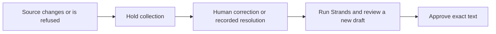

# Archon

**Archon helps a joiner reconcile inbox invoices and approve an exact collection draft with the source evidence beside it.**

[Open the AWS workstation](https://d2ssmv59q16d0b.cloudfront.net/) ·
[Human UAT testbook](https://d2ssmv59q16d0b.cloudfront.net/UAT.testbook.html) ·
[CI](https://github.com/upgradedev/archon-aws-strands/actions/workflows/ci.yml) ·
[Evidence and limits](#evidence-and-limits) · [Disclosures](#pre-existing-work-disclosed)

[](https://github.com/upgradedev/archon-aws-strands/actions/workflows/ci.yml)
[](LICENSE)

For the joiner doing client collections alone from an inbox: inspect what was invoiced,
what was received, and why a draft is ready or held. Paste synthetic email in Records;
no mailbox is connected. This replaces a manual comparison of invoice, remittance and draft
within this demonstration. Time savings and recovered money have not been measured.

Try it: Records → Add synthetic email → Sample invoice → Read & post email → Sample payment →
Read & post email → Workspace → Run Strands → inspect sources → approve the exact draft.
The sample is 1,860.00 EUR invoiced minus 600.00 EUR received, leaving 1,260.00 EUR.
Edit any sample before posting. A missing Transfer ID or conflicting invoice direction is refused;
use Correct source, supply the actual evidence, and read again. Original sources remain retained.

The public path runs real HTTP requests and a real Strands graph with six ledger tools.
The model is **scripted**, extraction uses bounded rules, and the outbox is **simulated**.
No public live model call or real email occurs. Removing Strands prevents draft preparation:
the composer only runs after all six readers have reported, and holds no tools of its own.

Current frontend SHA: [release.json](https://d2ssmv59q16d0b.cloudfront.net/release.json).
Current backend SHA and runtime modes: [API health](https://d2ssmv59q16d0b.cloudfront.net/api/health).
A branch CI pass is not evidence that this SHA is deployed.

[Current AWS acceptance](https://d2ssmv59q16d0b.cloudfront.net/acceptance.html) compares the
tested frontend/backend pair with the served versions. The public aggregate receipt is produced
only after all browser journeys and both release checks pass, with no failed or skipped cases.
An unavailable or historical receipt is not current acceptance. Human UAT remains NOT_RUN.
Source CI can require repository access; the sanitized aggregate does not. Historical testbooks
and run-scoped receipts are retained. The browser job receives no AWS credentials; a separate
main-only publisher can write only the existing frontend bucket. New frontend publication stops
if the deployed backend's packaged source differs; deploy that reviewed backend first and rerun.

## Contents

[Decision controls](#what-changes-the-decision) · [Workstation](#react-workstation-usage) ·
[Run it](#run-it) · [Architecture](#how-it-is-put-together) · [Evidence](#evidence-and-limits) ·
[Limitations](#limitations) · [Pre-existing work](#pre-existing-work-disclosed) ·
[Components](#third-party-components) · [Submission](#for-whoever-submits-this) · [Licence](#licence)

## What changes the decision

- A payment carries an explicit bank transfer reference. Email hashes identify evidence bytes,
  not payments. The same reference cannot credit again, even in a forward or a different subject.
  Distinct references can identify equal instalments on the same invoice/date/amount.
  A supplied reference is evidence, not independently verified bank settlement.
- The configured business is My Joinery, me@myjoinery.example in the public synthetic workspace.
  Original issuer and customer evidence determines payable versus receivable. “Billed to” alone
  does not make a sale. Conflicting directions stop intake. A forwarded message uses its original
  headers; the full source is retained.
- Missing identity asks for human correction. A duplicate can be linked to its original posted
  receipt without another credit. A disputed or ambiguous client reply holds collection until a
  person records an invoice-linked resolution. Resolution does not arbitrate a dispute.
- Corrections, new evidence, human resolution, ledger revision changes and expired drafts
  require fresh review. A SHA-256 fingerprint binds the exact text; the release gate rechecks facts.
  A hash is not proof that an invoice is true.
- Existing sessions retain posted sources. Historical equal payments without transfer identities
  remain readable with collections held for human reconciliation. No historical financial row is
  rewritten to assign it an invented bank identity. Records exposes each hold with a bounded
  identity-attestation form for distinct historical events. The additive attestation retains human
  notes and supplied references; it does not rewrite posted sources. Conflicting duplicate events
  require an operator accounting correction, not a fabricated second reference. The legacy
  one-firm SQLite surface has no attestation UI; hand its evidence to an operator.

## React workstation usage

Navigation: Dashboard → Workspace → Records → History. Legacy bookmarks still resolve.
Invoice and source selection survives navigation and reload. Only the backend's oldest overdue
invoice, largest on a tie, can be prepared; inspecting another invoice does not retarget it.

Dashboard balances derive from retained posted documents using exact cents. Observed session
outcomes count posts, refusals, corrections, resolutions and approval records. Human active time,
time saved, revenue and recovery benefits remain Unknown. Quarter reports are labelled separately.

In History, Prepare evidence bundle reads durable state. The readable export includes redacted
source excerpts, source hashes, decisions, corrections, backend and ledger revisions, runtime mode,
failure/recovery guidance and limits. Redaction is best effort; review before sharing.
The bundle does not attest authenticity, bank settlement, compliance or email arrival.

Public sessions use private S3 through API Gateway and Lambda, behind CloudFront and private S3
frontend hosting. Same-origin /api/* requests carry an opaque session handle. Session access expires
after seven days; physical storage retention is separately configured. The browser keeps only the
handle. Refresh durable state after an uncertain action; do not retry unknown sends automatically.
New workspace creates an empty session and does not delete the old records.

Local API storage is SQLite through ARCHON_SESSION_DB. Lambda uses ARCHON_STATE_BUCKET and a
private ARCHON_STATE_PREFIX. S3 errors never silently switch to temporary storage.
The public runtime cannot enable SES or Bedrock. No visibility or secret changes are needed.

## Run it

The login-free AWS URL above is the short path. These development commands run in CI for this
workspace; dependency installation, builds and tests are not run on the workstation.

Offline demonstration, with synthetic documents, scripted tone and simulated acceptance:

```bash
pip install -e ".[dev]"
python -m archon.demo
python -m uvicorn archon.web.app:app --port 8000
python -m archon.web.export site
```

The server-rendered app and static export are legacy regression surfaces, separate from the React
workstation. The static export is not interactive. There is no tenancy in that legacy one-firm
ARCHON_STORE configuration; the public API instead isolates synthetic visitor sessions.

Operator-only reasoning:

```bash
python -m archon.demo --live-model
```

ARCHON_BEDROCK_MODEL_ID defaults to eu.anthropic.claude-opus-5;
ARCHON_BEDROCK_REGION to eu-west-1; ARCHON_BEDROCK_MAX_TOKENS to 1024.
The configured Bedrock factory supplies the graph's model, region and token budget.
Extraction has a separate 4000-token budget; it is not a reasoning measurement.
ARCHON_BUSINESS_EMAIL and ARCHON_BUSINESS_NAME identify whose books an operator reads.

Operator live sending is separately gated by --live-send, explicit
ARCHON_OPERATOR_SEND_AUTHORIZATION=I_AUTHORIZE_CONTROLLED_SEND, a durable ARCHON_SEND_LEDGER
and an exact ARCHON_VERIFIED_RECIPIENT. Account/recipient eligibility must be verified by the
operator; historical SES sandbox observations are not current delivery authorization.
Provider acceptance is not delivery; unknown outcomes never retry automatically.

## How it is put together


The SVG is retained as the operator architecture illustration; it is not evidence of a deployed
mailbox or SES delivery. The image also works where a submission form renders no Mermaid.
The deployed public path is:

```mermaid
flowchart LR
  email["Synthetic email in Records"] --> reader["Redact and read bounded fields"]
  reader --> ledger["Check parties, transfer identity and arithmetic"]
  ledger --> graph["Six Strands readers"]
  graph --> composer["Composer: scripted, no tools"]
  composer --> gate["Exact draft and human approval"]
  gate --> receipt["Simulated acceptance"]
```



Every edge into the composer waits for all six reports. Strands executes the tools and joins
their outputs; it does not guarantee source authenticity. The scripted model walks the graph;
it does not judge. Ledger code selects the invoice and calculates amounts.

The runtime package declares strands-agents>=1.53.0; exact resolved versions are recorded by CI.
Live inference is optional operator behavior and has not been remeasured by this change.
AgentCore is not implemented; the [design note](docs/BEDROCK_AGENTCORE_ARCHITECTURE.md) is historical.

## Evidence and limits

Both earlier comparisons are withdrawn and stay withdrawn. They scored Archon from books that
fixtures had already posted correctly: a ledger agreeing with itself. Their historical files and
transcripts remain retained; they are not current product performance claims.

The retained [2026-09-09 evaluation](evidence/RESULTS-FAIR-2026-09-09.md) reported zero Archon chases.
That zero was achieved by not acting. It is not evidence of accuracy or usefulness.
The prior evaluator did not enforce exact target invoice and nonempty correct recipient.
Fresh synthetic contract tests now cover those fields and amount separately. No new benchmark
score, held-out reuse, competitive superiority or live model measurement is claimed.
python -m archon.evidence.fair is an evaluator command, not evidence of current performance.

Historical material: [first withdrawn set](evidence/RESULTS-2026-09-04.md),
[withdrawn hard set](evidence/RESULTS-HARD-2026-09-08.md),
[correction](evidence/RESULTS-CORRECTED-2026-09-08.md). The injection transcript belongs to a
withdrawn set; it has not been re-run on independent post and establishes no current advantage.

[Prior AWS acceptance](https://github.com/upgradedev/archon-aws-strands/actions/runs/34357703424)
is bound to 519a1e7c11a995529113161344192240fd031459 and artifact 10106786411, not this branch.
Current counts and coverage come from exact-SHA CI logs and artifacts, never a static estimate badge.
CI asserts the Strands API surface, runs unit/functional tests and real-HTTP desktop/mobile
Playwright, and checks documentation claims. Frontend coverage floors remain 85% in every measure.

Main merges still run offline checks → AWS frontend release → live Playwright acceptance, with
exact frontend SHA preflight/postflight. Backend deployment remains separate. Failure makes
the pipeline red and does not imply rollback. Human UAT stays NOT_RUN until a person executes it.
Future artifacts retain ninety days. Package AWS API has a manual archive-only option for the fixed
prior accepted artifact; it retains original bytes and SHA256 manifest for ninety days without
extracting or executing them. It does not erase or refresh the original artifact.

The full-history secret scan fetches all history (fetch-depth: 0) and uses gitleaks git
--log-opts=--all with redacted output. Its result is bound to the CI revision and retained artifact.

## Limitations

The firm and counterparties are entirely invented. No mailbox is connected. No bank feed,
payment execution, ERP, OCR or payroll provider exists. PDF text extraction exists in the legacy
operator reader; the public React intake accepts text. No live customer money is handled.
Nothing is submitted to any tax authority. Statutory-interest helpers are not a claim of legal
entitlement and the public draft does not include interest. Invoice headers and transfer references
are supplied assertions; source authenticity remains unverified. Human UAT and real-world benefit
measurement are NOT_RUN. General invoice extraction is not established by conventional sample success.

## Pre-existing work, disclosed

Archon is a product line and this build **shares a name and a domain** with earlier entries.
The submission rules require prior work to be disclosed. This build's public route uses pasted
synthetic inbox evidence and ends in simulated acceptance, not real email. Prior-work disclosure
does not establish novelty or eligibility; that determination belongs to the organizers.

Prior Archon repositories, from other hackathons:

`archon-cockroach-memory` (AWS Bedrock) · `h0-archon` (AWS + Vercel) · `archon-gcp-agentic` · `archon-gcp` · `archon-vibecoding` · `archon_azure` · `archon_nebius` · `archon-qwen-autopilot` · `archon-qwen-memoryagent` · `archon-datahub`

No code from any of them is in this repository. The shapes of `pyproject.toml` and `.github/workflows/ci.yml` follow a sibling project, `lasttake-aws`; pattern followed, no lines copied.


Pre-existing visual work disclosure: Kerdon's navy/panel/indigo direction informed the earlier
interface work. No components, dependencies, customer data, tenant configuration, identifiers or
metric values were reused. This disclosure is retained; it is not a source for new requirements.

## Third-party components

[Dependencies and licences](docs/THIRD-PARTY.md), including what Archon adds to Strands.
Re-derive installed licences with python -m archon.evidence.licences.

## For whoever submits this

[Description](docs/SUBMISSION-DESCRIPTION.md) · [Video script](docs/VIDEO-SCRIPT.md).
Both use the public synthetic path and its actual limits. A script is not a recording.

## Licence

MIT. See [LICENSE](LICENSE).
