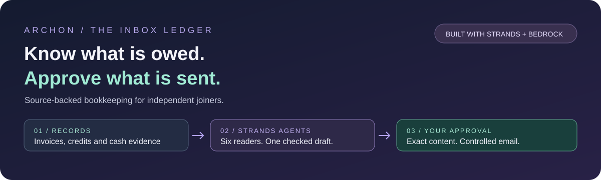
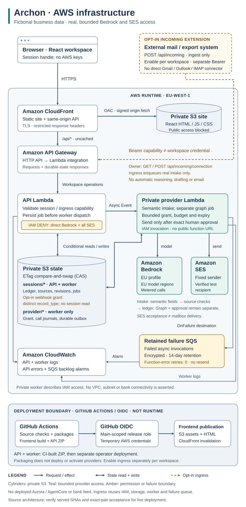

# Archon



**Archon helps independent joiners reconcile inbox invoices, check the remaining balance and approve an exact collection email.**

[Open the AWS app](https://d2ssmv59q16d0b.cloudfront.net/) · [Judge walkthrough](#judge-walkthrough) ·
[Evidence](#evidence-and-limits) · [Disclosures](#pre-existing-work-disclosed)

[Watch the 4:51 working demo](https://youtu.be/gpf1Dt8uYgY) ·
[Devpost submission](https://devpost.com/software/archon-dpgbe8) ·
[AWS Builder article](https://builder.aws.com/content/3JK1DF6ZxMYeyD1Ry5Kp07gmqET/agents-for-humans-archon-checks-the-balance-before-the-collection-email) ·
[Engineering article on dev.to](https://dev.to/efousekis/archon-keeping-financial-facts-outside-the-llm-with-strands-agents-hah)

Fictional records; real Bedrock and Strands Agents in controlled-live sessions. Retained
simulation instead uses a scripted model and simulated mail. Loading demo data calls neither.

[](https://github.com/upgradedev/archon-aws-strands/actions/workflows/ci.yml)
[](https://github.com/upgradedev/archon-aws-strands/actions/workflows/frontend-ci.yml)
[](https://github.com/upgradedev/archon-aws-strands/actions/workflows/frontend-deploy.yml)
[](LICENSE)
[](pyproject.toml)
[](frontend/package.json)
[](frontend/package.json)
[](frontend/package.json)
[](src/archon/agents/graph.py)
[](docs/ARCHITECTURE.md)

For a joiner doing client collections alone, an invoice and a remittance can tell different stories.
Archon brings those records together so the owner can see what remains owed, why collection is
ready or held, and exactly what a proposed email would say.

[Open the live AWS app](https://d2ssmv59q16d0b.cloudfront.net/) ·
[Judge walkthrough](#judge-walkthrough) · [How Strands is used](#how-it-is-put-together) ·
[Built with](#built-with) · [Docs](#documentation)

Built for **AWS Agents for Humans · Professional Agents**.

> Fictional business data; real Amazon Bedrock and Strands Agents in controlled-live sessions.
> Email requires separate approval and goes only to the configured test recipient. No money moves.

<a id="react-workstation-usage"></a>
<a id="try-it"></a>

## Judge walkthrough

No account or installation is required. Start with the books, then choose whether to run the agent.

| Step | What to do | What you can verify |
|---|---|---|
| 1. Open the books | [Open the demo setup](https://d2ssmv59q16d0b.cloudfront.net/#/demo) → **Load business portfolio** | 240 fictional records: sales, purchases, both credit types, receipts and supplier payments. No AI or email operation on load. |
| 2. Follow the evidence | Dashboard → a financial widget → Records | Real retained documents, filters and linked sources, not a static mockup. Credits and cash are distinct. |
| 3. Ask the agent | Workspace → **Run Strands & prepare draft** | In a controlled-live session, actual Bedrock execution through the Strands graph, followed by a checked draft. This is a metered action, not part of loading the demo. |
| 4. Keep control | Inspect the recipient, balance and exact draft | Sending needs explicit consent and approval. Skip sending if you only want to inspect the application. |
| 5. Read the outcome | History → recorded attempt → reload | The durable outcome survives reload. SES acceptance is not independent proof of inbox delivery. |

Use **Take a tour** in the workspace header for six short explanations. Next/Previous only change
the guide; opening a page is optional. The tour never seeds books, runs AI, enables Incoming or
approves a message. **Guided check** is the separate invoice → payment → review → outcome workflow.

<a id="what-changes-the-decision"></a>

Prefer one small case? Choose the optional **Load demo workspace** tutorial: a **1,860.00 EUR**
invoice, **600.00 EUR** payment and **1,260.00 EUR** remaining. This is separate from the full
portfolio. A duplicate transfer cannot credit the payment again; conflicting evidence holds
collection. Supplied records are not bank-verified facts.

**Demo data and execution mode are separate choices.** The examples are entirely invented in
both modes. A loaded sample workspace is ready to inspect, but it is not an AI result.

| Path | What actually happens | Email boundary |
|---|---|---|
| Load populated demo | Deterministic seed, no model call or draft | No email |
| Controlled-live session | Source-checked Bedrock intake; real Strands six-reader graph and composer | Exact human approval; SES restricted to a verified test recipient |
| Retained simulation | Real Strands graph; model is **scripted**, outbox is **simulated** | No real email; the script walks the graph, it does not judge |

The full portfolio covers 16 clients and 10 suppliers. [Dataset, counts and limits](docs/BUSINESS-DEMO.md)
explain the fixtures; the seed is not an AI extraction benchmark over 240 documents.

Check [frontend identity](https://d2ssmv59q16d0b.cloudfront.net/release.json),
[backend identity and mode](https://d2ssmv59q16d0b.cloudfront.net/api/health), and
[release acceptance](https://d2ssmv59q16d0b.cloudfront.net/acceptance.html) together.
Health reports configuration; it does not prove a model call or delivery.

<a id="limitations"></a>

## What you can bring

Paste fictional English plain-text invoice or remittance email in Records, or preview a UTF-8
`.txt` or plain-text `.eml` file up to 32 KB before posting it. Controlled-live extraction
requires explicit ISO dates, two-decimal EUR amounts and source-backed references.
PDFs, images, OCR, HTML and multipart email are not supported by the public intake.

No mailbox is connected. There is no bank feed, payment execution, payroll provider, or ERP
integration. Nothing is submitted to any tax authority. Recorded transfer references and headers
are supplied evidence, not proof of authenticity. Real customer data is outside this demo's scope.

### Automated input: opt-in extension

A session-scoped HTTP webhook accepts input from external mail/export systems.
The connection starts disabled and requires your own producer setup. Its separate, expiring
intake-only key cannot approve a draft or send mail. This is not direct Gmail or Outlook login.
[Setup, replay protection and limits](docs/incoming-webhook.md).

## Run it

The live walkthrough needs no installation. For development, use Python 3.11+ and Node 22.12+.
On this project's workstation, installs/builds/tests are CI-only. In an isolated runner, start
the API and, in a second terminal, the React app:

```bash
pip install -e ".[dev]"
python -m uvicorn archon.web.api:app --host 127.0.0.1 --port 8000
```

Then follow the [React runner setup](docs/OPERATIONS.md#react-workstation-and-public-api)
and open the Vite URL. Without live configuration, this development path uses a scripted
model and simulated mail. Operations also covers tests, configuration, deployment and the
separate legacy console/static surfaces. These commands do not enable AWS providers.

## How it is put together


[View architecture at full size](docs/architecture.svg) · [Architecture details](docs/ARCHITECTURE.md).
Both diagrams below are self-contained SVG images; no Mermaid renderer is required to read them.

Six Strands readers inspect suppliers, sales, payroll, trading, cash and metrics from the retained
ledger. Each reports before the composer can run; the composer holds no tools. Bedrock supplies
model interpretation and wording, while deterministic code selects the invoice and verifies
amounts. Removing Strands prevents draft preparation.

The configured model default is `eu.anthropic.claude-opus-5`; check the exact worker
configuration and observed invocation evidence, not the badge, for a particular release.



[View infrastructure at full size](docs/infrastructure.svg). The dashed extension requires opt-in and producer setup.

CloudFront serves React from private S3 and routes `/api/*` through API Gateway to Lambda.
The API saves jobs and dispatches a separate durable worker; its role cannot invoke Bedrock or
SES directly. Private S3 sessions use compare-and-swap writes to reject stale changes.
The worker reserves finite provider budget before calling Bedrock or controlled SES.
AgentCore and Aurora are not deployed. These diagrams explain the design, not invocation evidence.

New evidence, changed revisions, holds or expiry require fresh review of the exact draft.
Refresh after an uncertain action; never retry unknown sends automatically.

## Evidence and limits

The [live release receipt](https://d2ssmv59q16d0b.cloudfront.net/acceptance.html) identifies the
exact tested frontend/backend pair, observed model calls and SES acceptances. The
[AWS deployment workflow](https://github.com/upgradedev/archon-aws-strands/actions/workflows/frontend-deploy.yml)
also retains separate real-AWS portfolio browser results. These execute the application, not slides.
Check the served identities against the receipt; a green source build alone does not prove deployment.

Independent AI accuracy, time saved and money recovered are unmeasured. Earlier comparison
claims are withdrawn. Human UAT remains **NOT_RUN**; prior owner-reported mailbox arrival does
not establish delivery for every later attempt. The [evidence register](docs/EVALUATION.md)
retains the original results, limitations and frozen protocols. The [UAT testbook](https://d2ssmv59q16d0b.cloudfront.net/UAT.testbook.html)
separates automated checks from human acceptance.

## Built with

| Layer | Technology and role |
|---|---|
| Agent orchestration | **Strands Agents SDK**: `Agent`, scoped `@tool` readers and `GraphBuilder` fan-in to a tool-less composer. [Implementation](src/archon/agents/graph.py) |
| AI inference | **Amazon Bedrock**: source-checked interpretation and draft wording, not authority to send. [Execution modes](docs/ARCHITECTURE.md) |
| User application | **React 19, TypeScript, Tailwind CSS, Vite**: Dashboard, Records, Incoming, Guided check, Workspace and History. |
| AWS runtime | **CloudFront, private S3, API Gateway and Lambda**: frontend hosting, isolated durable sessions and a separate provider worker. |
| Controlled email | **Amazon SES** after exact human approval; no arbitrary-recipient sending. |
| Delivery and verification | **CloudFormation, GitHub Actions, pytest, Vitest and Playwright**. Tests, release and observed AWS acceptance are separate checks. |

<a id="contents"></a>
<a id="third-party-components"></a>
<a id="for-whoever-submits-this"></a>

## Documentation

| Need | Read |
|---|---|
| Source formats, duplicate holds, arrangements and recovery | [User guide](docs/USER-GUIDE.md) |
| Strands graph, storage and actual AWS infrastructure | [Architecture](docs/ARCHITECTURE.md) |
| CI quickstart, configuration and controlled provider operations | [Operations](docs/OPERATIONS.md) |
| Incoming automation and its deployment boundary | [Incoming webhook](docs/incoming-webhook.md) |
| Richer books, six document types and dataset provenance | [Business portfolio](docs/BUSINESS-DEMO.md) |
| Historical measurements and frozen evaluation instruments | [Evaluation and evidence](docs/EVALUATION.md) |
| What the workflow demonstrates and does not measure | [Workflow and limits](docs/DIFFERENTIATION.md) |
| Prior work and dependency notices | [Prior work](docs/PRIOR-WORK.md) · [Third-party components](docs/THIRD-PARTY.md) |
| Optional, unimplemented AgentCore design | [Historical design note](docs/BEDROCK_AGENTCORE_ARCHITECTURE.md) |
| Image disclosures | [Brand artwork and concept-image limits](docs/GRAPHICS.md) |
| Submission context and recorded demo | [Description and scope](docs/SUBMISSION-DESCRIPTION.md) · [Video script and recording evidence](docs/VIDEO-SCRIPT.md) |

## Pre-existing work, disclosed

Archon shares its name and domain with ten earlier Archon repositories. No code from any of them is in this repository.
The [full disclosure](docs/PRIOR-WORK.md) names each repository, the `lasttake-aws` package/CI
pattern and Kerdon's earlier visual influence. Prior work does not establish novelty or eligibility.
The four supplied JPGs are concept art, not product screenshots or current infrastructure.

## Licence

MIT. See [LICENSE](LICENSE) and [third-party notices](docs/THIRD-PARTY.md).
