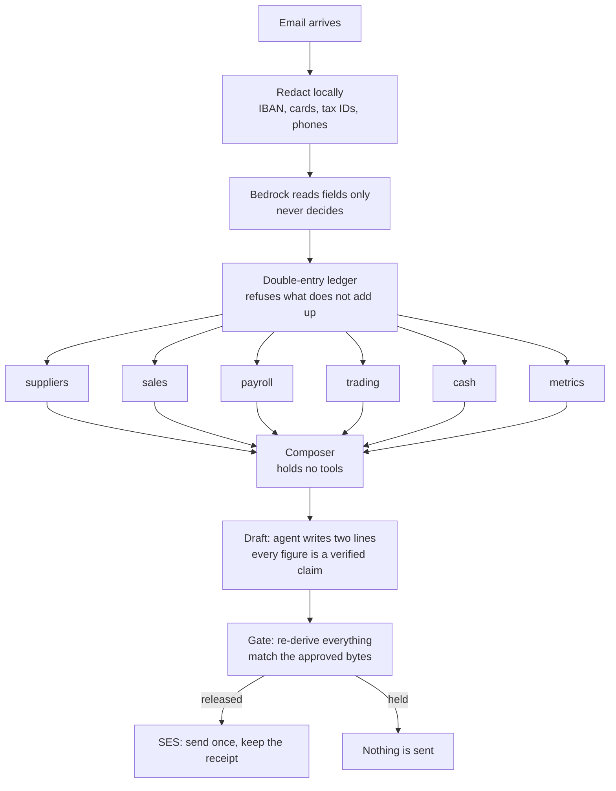
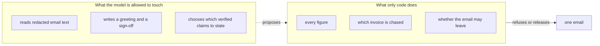

# Archon

**Archon reads the invoices landing in your inbox, keeps your books current, and sends the one email chasing what you are owed once you approve.**

Built for **Agents for Humans (AWS)**, track **Professional Agents**, on the **Strands Agents SDK** and **Amazon Bedrock**.

---

## The person this is for

A sole trader or micro-business owner who runs the whole back office alone, out of an inbox. Supplier invoices to enter, payments to make, money to collect, payroll, tax deadlines, and no view of how any of it connects. Nothing is delegated, because there is nobody to delegate to, and every one of those chores arrives as another email.

They do not have accounting software. That is the point: the software assumes a bookkeeper operates it, and they are the bookkeeper, at the kitchen table, on a Sunday night.

## The one thing it does

It sends **one email**, after a human approves **that exact text**: the chase to the client who has not paid.

Everything else — reading the post, keeping double-entry books across six domains, producing the P&L and the cash position — exists to make that one email correct.

---

## The number

Twenty months of one firm's post, every answer known by construction. Re-run it yourself:

```bash
python -m archon.evidence.compare
```

| method | wrong money | missed | correct | 95% CI on wrong money |
|---|---|---|---|---|
| reference matching, how small-business software reconciles | 0 / 20 | **13** | 7 | 0.0% to 16.1% |
| naive text extraction | 19 / 20 | 0 | 1 | 76.4% to 99.1% |
| **a real Claude model, one pass, no ledger** | **0 / 20** | **3** | 17 | 0.0% to 16.1% |
| **Archon** | 0 / 20 | 0 | 20 | 0.0% to 16.1% |

**Wrong money** is an email demanding a figure that is not owed. It reaches a client and cannot be recalled. **A missed chase** is silence where money was owed. Both are shown, because a method that never sends anything scores zero on the first.

### What this does and does not show

**It was built expecting the opposite result.** The hypothesis was that a plain model would demand the invoice total from a client who had part paid. It does not. A frontier model reading the same post got **no figure wrong** and seventeen of twenty right. The number is published as it came.

So the claim is narrower, and it survives the model being good:

> The model was right seventeen times and silent three times, and **nothing in its answer tells you which**. Archon's answer carries its check with it.

**Archon's twenty out of twenty is partly circular** and is not the interesting row. Archon's answer and the scenario's truth are computed from the same postings, so it cannot lose. What the offline rows honestly measure is whether a method's *data model* can represent the answer at all: reference matching cannot represent a part payment, which is why it goes quiet thirteen times.

**This is a friendly test.** Twenty clean scenarios, one client each, no contradictory messages, no adversarial text. The interval on every zero runs to 16.1% because n is twenty. Full write-up: [`evidence/RESULTS-2026-09-04.md`](evidence/RESULTS-2026-09-04.md).

---

## Run it

No AWS account, no key, no network.

```bash
pip install -e ".[dev]"
python -m archon.demo
```

That walks the whole journey: post arrives, books are kept, six Strands agents read one domain each, a chase is drafted from claims the ledger confirmed, the gate decides, a human approves, the email leaves, the receipt is read back.

The screen:

```bash
python -m uvicorn archon.web.app:app --port 8000
```

Paste an invoice into **forward it an email** and watch what gets hidden before anything reads it, then change a figure so the total stops adding up. Then press **the client pays at lunchtime** and try to send the draft you were reading.

With AWS:

```bash
python -m archon.demo --live-model     # reason on Bedrock
python -m archon.demo --live-send      # send through SES, needs verified addresses
```

Offline mode uses a scripted model. It walks the graph; **it does not judge**. Tone and the decision to chase are a model's work.

---

## How it is put together



Every edge into the composer carries a condition satisfied only when **all six** readers have reported. The Strands graph fires a node under OR semantics in Python, so six edges alone would let the composer start on one report.



### The rules that carry it

- **A journal entry that does not balance is refused at construction.** No report downstream can silently lose money.
- **Every entry names the email it came from.** A number on screen walks back to the document.
- **Settlement is derived, never stored.** A "paid" flag that can disagree with the ledger is how books start lying.
- **No digit reaches a client except through a verified claim.** The agent writes the greeting and the sign-off, and a draft whose free text contains a number is refused outright.
- **Approval binds to a SHA-256 of the exact bytes.** One edited character invalidates it, and the gate re-derives every fact at send time — so a client who paid at lunchtime is not chased with a draft that was correct that morning.
- **Every agent tool is a read.** No sequence of tool calls an agent invents can change the books or reach a client.

---

## What is real and what is not

| | |
|---|---|
| the ledger, six domains, P&L, cash, metrics | real, 239 tests, 93% branch coverage |
| the six-agent Strands graph | real, runs on `strands-agents` 1.53 and 1.54 |
| Bedrock | real, `global.anthropic.claude-opus-5`, verified by a live call |
| SES send, idempotent, with receipt | real code; **the account is in the SES sandbox**, so it can send only to verified addresses |
| reading a forwarded email | real; redaction, typed extraction and the ledger's arithmetic check. Offline it is read by rules and the page says so, with Bedrock it reads anything |
| the firm, its clients, its staff | **entirely invented.** No customer data is present anywhere in this repository |
| deployment | not yet. It runs locally |

---

## Pre-existing work, disclosed

Archon is a product line and this is a new build on AWS. The submission rules require prior work to be disclosed, and the honest position is that this project **shares a name and a domain** with earlier entries while the persona, the trigger, the hero mechanism and the write are all different: this one is triggered by an inbox and ends in one governed email, where the others started from a file, an upload or a document store.

Prior Archon repositories, from other hackathons:

`archon-cockroach-memory` (AWS Bedrock) · `h0-archon` (AWS + Vercel) · `archon-gcp-agentic` · `archon-gcp` · `archon-vibecoding` · `archon_azure` · `archon_nebius` · `archon-qwen-autopilot` · `archon-qwen-memoryagent` · `archon-datahub`

No code from any of them is in this repository. The shapes of `pyproject.toml` and `.github/workflows/ci.yml` follow a sibling project, `lasttake-aws`; pattern followed, no lines copied.

## Limitations

- One firm, held in memory. There is no tenancy and no persistence.
- The inbound reader is exercised against pasted text, fixtures and a fake Bedrock client. No mailbox is connected: nothing polls IMAP and no SES receipt rule is deployed.
- Payroll is ledger state only. No payroll provider is called and no real person's pay is handled.
- VAT is recorded, not filed. Nothing is submitted to any tax authority.
- The comparison is twenty clean scenarios. It says nothing about behaviour under noise.

## Licence

MIT. See [`LICENSE`](LICENSE).
