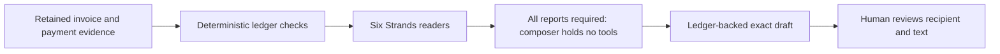
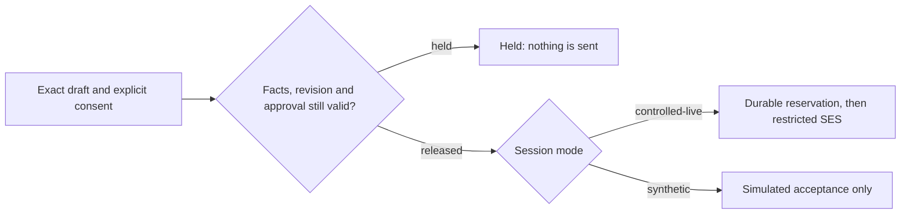

# Architecture: what runs and what is optional

For the joiner reviewing inbox records in the [AWS workstation](https://d2ssmv59q16d0b.cloudfront.net/),
controlled-live mode uses Bedrock and restricted SES; retained simulation uses a scripted
Strands model and simulated acceptance. Read [release.json](https://d2ssmv59q16d0b.cloudfront.net/release.json),
[/api/health](https://d2ssmv59q16d0b.cloudfront.net/api/health), and
[exact-pair acceptance](https://d2ssmv59q16d0b.cloudfront.net/acceptance.html).
[Evidence](EVALUATION.md) and [disclosures](../README.md#pre-existing-work-disclosed) apply to both modes.

## Product path

The public application helps one joiner reconcile supplied invoice/remittance records and review
an exact collection draft. Its controlled-live mode uses real Strands and Bedrock with a separate
SES worker. Loading the populated demo only seeds deterministic records: no model call or email.

### Six readers and a composer

[Graph wiring](../src/archon/agents/wiring.py) names these readers and their single ledger tools:

| Reader | Tool | Question the model considers |
|---|---|---|
| suppliers | `supplier_position` | What does the firm owe suppliers, and what can wait? |
| sales | `sales_position` | What do clients owe, and who is already settling in stages? |
| payroll | `payroll_position` | What do retained records say about paying the firm's people? |
| trading | `trading_position` | What do recorded trading figures show? |
| cash | `cash_position` | What movement is recorded in the books? |
| metrics | `headline_metrics` | Which recorded headline needs the owner's attention? |

These tools read the application's ledger. Their names do not mean a bank, payroll or external
accounting system is connected. Missing business evidence remains missing.
Each reader produces a report ending in URGENT, WATCH or FINE. In controlled-live mode Bedrock
interprets these views; synthetic mode uses a scripted model that traverses the same SDK graph.

[Graph execution](../src/archon/agents/graph.py) and the
[edge condition](../src/archon/agents/gating.py) require all six reports before the composer runs.
The composer holds no tools. It supplies opening/closing text, while
[claims](../src/archon/agents/claims.py) and [draft construction](../src/archon/agents/draft.py)
derive verified figures from the ledger and refuse digits in model-authored free text.
The controlled path requires a bounded JSON response; malformed output releases no draft.

[Release checks](../src/archon/agents/gate.py) bind approval to the exact draft fingerprint and
recheck invoice, recipient, balance, ledger revision and expiry. There is no amount below which
approval becomes optional. New/refused evidence or a collection hold invalidates readiness.
A hash identifies bytes, not the truth of the original invoice.

## AWS infrastructure and source extensions

The diagram describes component roles. The last supplied accepted frontend/backend pair is
recorded in [Evaluation](EVALUATION.md); it does not establish acceptance of newer changes.

| Component | Source | Boundary |
|---|---|---|
| React on CloudFront + private S3 | [Frontend stack](../infra/frontend_stack.py), [React source](../frontend/src) | Static assets; same-origin `/api/*` forwarding |
| API Gateway and Lambda API | [API stack](../infra/archon_api_stack.py), [live API additions](../deploy/live_api_stack.py), [API](../src/archon/web/api.py) | Handles sessions and saves/dispatches jobs; direct Bedrock and SES calls denied |
| Private S3 sessions | [Session store](../src/archon/store/sessions.py) | `IfNoneMatch` on create, ETag `IfMatch` on update; conflicts require reread |
| Separate provider Lambda | [Worker stack](../deploy/live_provider_stack.py), [worker](../src/archon/web/live.py) | Only configured model/region, sender/recipient and finite grant |
| Durable provider journal/outbox | [Execution store](../src/archon/store/execution.py), [metering](../src/archon/adapters/metered.py), [SES](../src/archon/adapters/ses.py) | Reserve before provider calls; record outcomes; unknown sends never retry automatically |
| Retained failure queue and alarm | [Worker stack](../deploy/live_provider_stack.py) | SQS holds async failure records; operator reconciliation, not an automatic resend pipeline |
| Opt-in incoming HTTP webhook | [Source contract](incoming-webhook.md) | Per-workspace key starts disabled; producer setup and served-identity/acceptance checks required; intake only |

A public session holds one JSON document in private S3. The browser holds an opaque session handle,
not a database credential. Session access expires after seven days, independently of bucket lifecycle
retention. There is no fallback to ephemeral Lambda state if S3 is unavailable.
This is demo session isolation, not a complete multi-tenant business account system.

The API saves a pending job before invocation. The worker claims it by conditional write, uses the
existing global operating grant and checks exact `real-email` consent again before sending.
The worker's IAM permissions and runtime checks limit SES to the configured verified test recipient.
A configured mode or provider response does not prove mailbox delivery.

## Real model and simulated model

The configured Bedrock profile is `eu.anthropic.claude-opus-5` in `eu-west-1`.
The controlled worker uses metered non-streaming Strands with a 2048-token output limit;
semantic extraction has a separate 4000-token budget and literal source-field checks.
The legacy operator model factory defaults to 1024 tokens and has separate overrides.
[Operations](OPERATIONS.md) records those distinctions and the token-count route.

Synthetic sessions use `PublicPostReader` and `LedgerScriptModel`; they never become real sends
merely because live providers later become available. `LocalReader` remains a legacy reader.
The frozen evaluation collector is direct Converse, not this graph; its results cannot stand in
for graph acceptance or general model benefit.

## Not deployed or connected

AgentCore runtime, Action Groups, hosted Guardrails, Aurora/Aurora DSQL, DynamoDB audit seals,
a bank feed, payment execution, mailbox OAuth/IMAP, OCR and a payroll provider are not deployed
product capabilities. Public intake is English plain text with bounded EUR/date/reference formats.

[BEDROCK_AGENTCORE_ARCHITECTURE.md](BEDROCK_AGENTCORE_ARCHITECTURE.md) is an optional historical
design sketch. It contains proposed topology and contracts, not running infrastructure.
[The four JPGs](GRAPHICS.md) contain broader concept claims and are not product screenshots.
